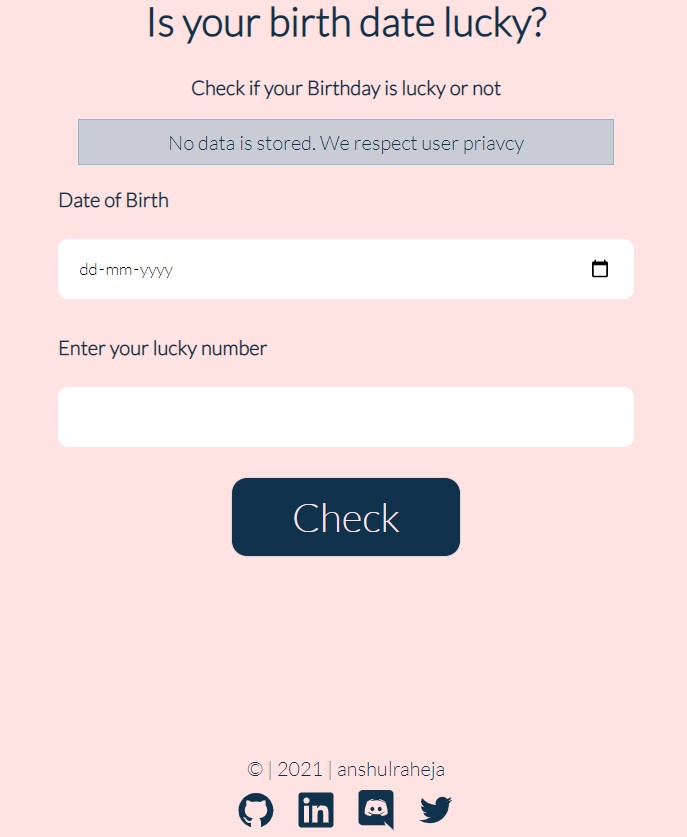

# Birthday Lucky or Not?

### Description

###### (levelZero_markEleven)

The app checks if the user birthdate is lucky or not by checking if the user's birthdate is divisible by user's lucky number.



### My learnings

- useState hook
- Data validation
- modulus operator

### Tech Stack

React, CSS

# Installation

```bash
git clone https://github.com/anshulraheja/levelZero_markEleven.git
npm install
```

CodeSandBox [Link](https://codesandbox.io/s/github/anshulraheja/levelZero_markEleven)
